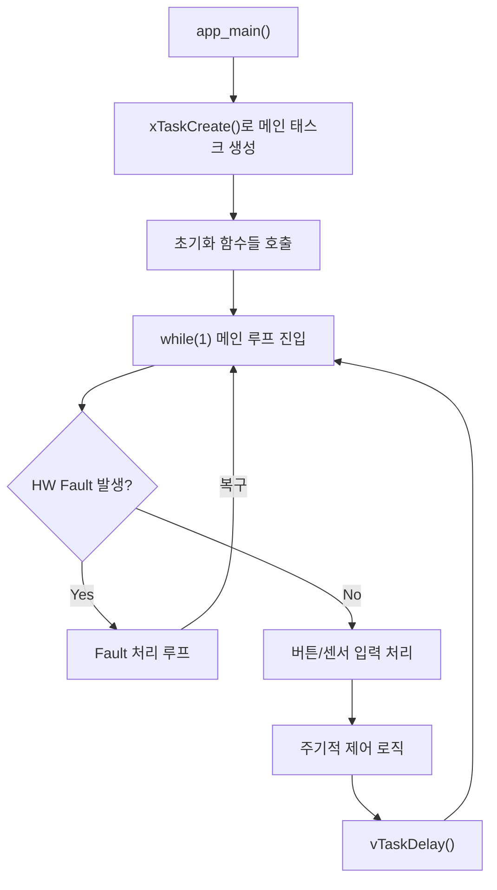

# ps_pwm 라이브러리 API 사용 가이드

`examples/ps_pwm_basic`를 참조하여, 나만의 응용 프로그램을 만들 때 호출해야 하는 함수들과 main while 루프 구성 방법을 설명합니다.

---

## 1. 전체 흐름 요약



---

## 2. 초기화 단계 — 반드시 호출해야 하는 함수

### 2.1. 핵심 초기화: `pspwm_init_symmetrical()` 또는 `pspwm_init()`

| 함수 | 용도 |
|---|---|
| [pspwm_init_symmetrical()](file:///home/yoonki/esp/myWorks/esp32_ps_pwm/include/ps_pwm.h#L152-L163) | Rising/Falling 엣지 데드타임이 동일할 때 (간편 버전) |
| [pspwm_init()](file:///home/yoonki/esp/myWorks/esp32_ps_pwm/include/ps_pwm.h#L133-L144) | 4개 데드타임을 개별 설정할 때 (풀 버전) |

```c
// 간편 버전 (대부분의 경우 이것으로 충분)
esp_err_t err = pspwm_init_symmetrical(
    MCPWM_UNIT_0,             // MCPWM 유닛 (0 또는 1)
    GPIO_NUM_5,               // Lead Leg Low Side
    GPIO_NUM_4,               // Lead Leg High Side
    GPIO_NUM_7,               // Lag Leg Low Side
    GPIO_NUM_6,               // Lag Leg High Side
    100e3f,                   // 주파수 (Hz) — 예: 100kHz
    0.0f,                     // 초기 Phase-Shift Duty (0.0~1.0)
    125e-9f,                  // Lead Leg 데드타임 (초) — 예: 125ns
    125e-9f,                  // Lag Leg 데드타임 (초) — 예: 125ns
    true,                     // 초기 출력 상태 (true = ON)
    MCPWM_FORCE_MCPWMXA_LOW,  // Lead Leg disable 시 출력 동작
    MCPWM_FORCE_MCPWMXA_LOW   // Lag Leg disable 시 출력 동작
);
```

> [!IMPORTANT]
> 이 함수는 **반드시 한 번만** 호출합니다. 내부적으로 MCPWM 타이머, 오퍼레이터, 컴패레이터, 제너레이터, 데드타임 모듈을 모두 초기화합니다.

### 2.2. 하드웨어 Fault 보호 설정 (선택이지만 강력 권장)

```c
// Fault 핀에 풀업 활성화 (오동작 방지)
gpio_pullup_en(gpio_fault_shutdown);
vTaskDelay(pdMS_TO_TICKS(10));

// HW Fault 입력 등록
pspwm_enable_hw_fault_shutdown(
    MCPWM_UNIT_0,
    GPIO_NUM_8,                // Fault 입력 GPIO
    MCPWM_LOW_LEVEL_TGR        // LOW일 때 Fault 트리거
);

// 초기화 과정에서 발생한 스퓨리어스 Fault 클리어
pspwm_clear_hw_fault_shutdown_occurred(MCPWM_UNIT_0);

// 출력 명시적 활성화
pspwm_resync_enable_output(MCPWM_UNIT_0);
```

| 함수 | 역할 |
|---|---|
| [pspwm_enable_hw_fault_shutdown()](file:///home/yoonki/esp/myWorks/esp32_ps_pwm/include/ps_pwm.h#L277-L279) | HW Fault GPIO 핀 등록, OST(One-Shot Trip) 래칭 활성화 |
| [pspwm_clear_hw_fault_shutdown_occurred()](file:///home/yoonki/esp/myWorks/esp32_ps_pwm/include/ps_pwm.h#L246) | Fault 발생 플래그 리셋 (출력은 재활성화하지 않음) |
| [pspwm_resync_enable_output()](file:///home/yoonki/esp/myWorks/esp32_ps_pwm/include/ps_pwm.h#L267) | Fault 해제 후 타이머 재동기화 + 출력 활성화 |

---

## 3. 런타임 제어 함수 — while 루프 안에서 사용

### 3.1. 출력 On/Off 제어

| 함수 | 설명 |
|---|---|
| [pspwm_disable_output()](file:///home/yoonki/esp/myWorks/esp32_ps_pwm/include/ps_pwm.h#L256) | 소프트 Fault를 트리거하여 즉시 출력 비활성화 |
| [pspwm_resync_enable_output()](file:///home/yoonki/esp/myWorks/esp32_ps_pwm/include/ps_pwm.h#L267) | 타이머 재동기화 후 출력 재활성화 |

```c
// 출력 끄기
pspwm_disable_output(MCPWM_UNIT_0);

// 출력 다시 켜기
pspwm_resync_enable_output(MCPWM_UNIT_0);
```

### 3.2. 주파수 변경

```c
pspwm_set_frequency(MCPWM_UNIT_0, 200e3);  // 200kHz로 변경
```

> [!NOTE]
> 프리스케일러 설정을 변경하지 않으므로 `pspwm_init_*()` 호출 시 설정된 클럭 범위 안에서만 동작합니다.

### 3.3. Phase-Shift Duty 즉시 변경

```c
pspwm_set_ps_duty(MCPWM_UNIT_0, 0.5f);  // 50% 위상 시프트 (즉시 적용)
```

### 3.4. Phase-Shift Duty 부드럽게 변경 (Soft Start/Stop)

```c
// 현재 duty에서 75%까지 2초에 걸쳐 서서히 변경
pspwm_set_duty_soft(MCPWM_UNIT_0, 0.75f, 2000);

// soft-start 중단 및 duty 즉시 0%로 리셋
pspwm_set_duty_soft(MCPWM_UNIT_0, 0.0f, 0);
```

> [!TIP]
> `duration_ms = 0`이면 내부적으로 `pspwm_set_ps_duty()`를 즉시 호출하므로, 진행 중인 soft-start 태스크를 중단하고 duty를 즉시 설정하는 용도로도 사용할 수 있습니다.

### 3.5. 데드타임 변경

```c
// 대칭 데드타임 (간편)
pspwm_set_deadtimes_symmetrical(MCPWM_UNIT_0, 150e-9f, 200e-9f);

// 비대칭 데드타임 (4개 개별)
pspwm_set_deadtimes(MCPWM_UNIT_0,
    100e-9f,   // lead rising edge
    150e-9f,   // lead falling edge
    120e-9f,   // lag rising edge
    180e-9f    // lag falling edge
);
```

### 3.6. HW Fault 감지 및 복구

| 함수 | 반환 | 용도 |
|---|---|---|
| [pspwm_get_hw_fault_shutdown_occurred()](file:///home/yoonki/esp/myWorks/esp32_ps_pwm/include/ps_pwm.h#L239) | `bool` | Fault가 발생한 **이력**이 있는지 (래칭) |
| [pspwm_get_hw_fault_shutdown_present()](file:///home/yoonki/esp/myWorks/esp32_ps_pwm/include/ps_pwm.h#L232) | `bool` | Fault 조건이 **현재** 활성인지 (실시간) |
| [pspwm_clear_hw_fault_shutdown_occurred()](file:///home/yoonki/esp/myWorks/esp32_ps_pwm/include/ps_pwm.h#L246) | `void` | Fault 이력 플래그만 리셋 |

Fault 복구 순서 (안전한 패턴):
```c
// 1. 소프트 Fault로 출력 확보
pspwm_disable_output(MCPWM_UNIT_0);
// 2. HW Fault 래치 클리어
pspwm_clear_hw_fault_shutdown_occurred(MCPWM_UNIT_0);
// 3. 필요 시 출력 재활성화
pspwm_resync_enable_output(MCPWM_UNIT_0);
```

> [!CAUTION]
> 반드시 `pspwm_disable_output()` → `pspwm_clear_hw_fault_shutdown_occurred()` 순서로 호출해야 합니다. 순서가 반대면 클리어 직후 출력이 일시적으로 활성화되는 글리치가 발생할 수 있습니다.

### 3.7. 상태 조회 (읽기 전용)

```c
pspwm_setpoint_t *sp;
pspwm_get_setpoint_ptr(MCPWM_UNIT_0, &sp);
printf("현재 주파수: %.0f Hz, Duty: %.1f%%\n", sp->frequency, sp->ps_duty * 100);

pspwm_setpoint_limits_t *limits;
pspwm_get_setpoint_limits_ptr(MCPWM_UNIT_0, &limits);
printf("허용 주파수 범위: %.0f ~ %.0f Hz\n", limits->frequency_min, limits->frequency_max);

pspwm_clk_conf_t *clk;
pspwm_get_clk_conf_ptr(MCPWM_UNIT_0, &clk);
printf("타이머 클럭: %.0f Hz\n", clk->timer_clk);
```

---

## 4. main while 루프 템플릿

[ps_pwm_basic/main.c](file:///home/yoonki/esp/myWorks/esp32_ps_pwm/examples/ps_pwm_basic/main/main.c)에서 추출한 핵심 패턴입니다:

```c
void my_app_task(void *arg)
{
    // ═══════════════ 1단계: 초기화 ═══════════════
    pspwm_init_symmetrical(/* ... 파라미터 ... */);
    gpio_pullup_en(GPIO_FAULT);
    vTaskDelay(pdMS_TO_TICKS(10));
    pspwm_enable_hw_fault_shutdown(MCPWM_UNIT_0, GPIO_FAULT, MCPWM_LOW_LEVEL_TGR);
    pspwm_clear_hw_fault_shutdown_occurred(MCPWM_UNIT_0);
    pspwm_resync_enable_output(MCPWM_UNIT_0);

    // ═══════════════ 2단계: 상태 변수 ═══════════════
    bool is_output_enabled = true;
    uint32_t loop_counter = 0;

    // ═══════════════ 3단계: 메인 루프 ═══════════════
    while (1) {
        // ─────────── (A) HW Fault 체크 (최우선) ───────────
        if (pspwm_get_hw_fault_shutdown_occurred(MCPWM_UNIT_0)) {
            // Fault 처리: LED 경고, 버튼 대기, 복구 로직
            // ...복구 후 continue로 루프 처음으로
            continue;
        }

        // ─────────── (B) 사용자 입력 처리 ───────────
        // 예: 버튼, UART, ADC, 통신 등
        if (/* 버튼 눌림 */) {
            if (is_output_enabled) {
                pspwm_disable_output(MCPWM_UNIT_0);
                pspwm_set_duty_soft(MCPWM_UNIT_0, 0.0f, 0);
                is_output_enabled = false;
            } else {
                pspwm_set_ps_duty(MCPWM_UNIT_0, 0.0f);
                pspwm_resync_enable_output(MCPWM_UNIT_0);
                pspwm_set_duty_soft(MCPWM_UNIT_0, 1.0f, 5000);
                is_output_enabled = true;
            }
        }

        // ─────────── (C) 주기적 제어 로직 ───────────
        if (loop_counter % 500 == 0 && is_output_enabled) {
            // 주파수 변경, duty 변경, 데드타임 조정 등
            pspwm_set_frequency(MCPWM_UNIT_0, new_freq);
            pspwm_set_duty_soft(MCPWM_UNIT_0, new_duty, ramp_ms);
        }

        // ─────────── (D) 루프 딜레이 ───────────
        loop_counter++;
        vTaskDelay(pdMS_TO_TICKS(10));  // 10ms 주기
    }
}

void app_main(void)
{
    xTaskCreate(my_app_task, "my_app_task", 4096, NULL, 5, NULL);
}
```

---

## 5. 메인 루프 설계 핵심 원칙

| 원칙 | 설명 |
|---|---|
| **Fault 체크 최우선** | 루프 최상단에서 `pspwm_get_hw_fault_shutdown_occurred()` 확인. Fault 시 제어 로직을 건너뜁니다 |
| **Soft Fault로 안전한 On/Off** | `pspwm_disable_output()` / `pspwm_resync_enable_output()` 조합 사용 |
| **Soft Start로 부드러운 전환** | `pspwm_set_duty_soft()`로 급격한 duty 변화 방지 |
| **enable 전 duty 리셋** | `pspwm_resync_enable_output()` 직전에 `pspwm_set_ps_duty(0.0f)`로 0%에서 시작 |
| **비차단 루프 유지** | `vTaskDelay(pdMS_TO_TICKS(10))`으로 10ms 주기 폴링, CPU 독점 방지 |
| **`app_main`은 간결하게** | `xTaskCreate()`로 메인 태스크를 생성하고 즉시 반환 |

---

## 6. 전체 API 함수 요약표

### 초기화 (1회 호출)
| 함수 | 필수 여부 |
|---|---|
| `pspwm_init_symmetrical()` | ✅ 필수 (또는 `pspwm_init()`) |
| `pspwm_enable_hw_fault_shutdown()` | ⚠️ 강력 권장 |
| `pspwm_clear_hw_fault_shutdown_occurred()` | ⚠️ 초기화 후 호출 권장 |
| `pspwm_resync_enable_output()` | ⚠️ 초기 출력 활성화 |

### 런타임 제어 (루프 내 반복 호출 가능)
| 함수 | 용도 |
|---|---|
| `pspwm_set_frequency()` | 주파수 변경 |
| `pspwm_set_ps_duty()` | Phase-Shift Duty 즉시 설정 |
| `pspwm_set_duty_soft()` | Phase-Shift Duty 점진적 변경 |
| `pspwm_set_deadtimes()` / `_symmetrical()` | 데드타임 변경 |
| `pspwm_disable_output()` | 출력 즉시 비활성화 |
| `pspwm_resync_enable_output()` | 출력 재활성화 |

### Fault 관리 (루프 내 폴링)
| 함수 | 용도 |
|---|---|
| `pspwm_get_hw_fault_shutdown_occurred()` | Fault 이력 확인 (래칭) |
| `pspwm_get_hw_fault_shutdown_present()` | Fault 현재 상태 확인 (실시간) |
| `pspwm_clear_hw_fault_shutdown_occurred()` | Fault 래치 클리어 |

### 상태 조회 (읽기 전용)
| 함수 | 반환 데이터 |
|---|---|
| `pspwm_get_setpoint_ptr()` | 현재 주파수, duty, 데드타임, 출력상태 |
| `pspwm_get_setpoint_limits_ptr()` | 허용 주파수/데드타임 범위 |
| `pspwm_get_clk_conf_ptr()` | 클럭 프리스케일러 설정 |
