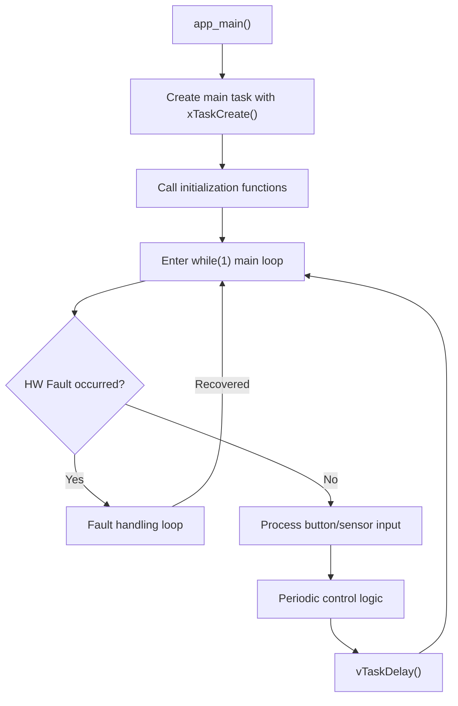

# ps_pwm Library API Usage Guide

Referring to the `examples/ps_pwm_basic` example, this guide explains the functions you need to call and how to structure the main `while` loop when creating your own application.

---

## 1. Overall Flow Summary



---

## 2. Initialization Phase — Mandatory Functions

### 2.1. Core Initialization: `pspwm_init_symmetrical()` or `pspwm_init()`

| Function | Purpose |
|---|---|
| [pspwm_init_symmetrical()](file:///home/yoonki/esp/myWorks/esp32_ps_pwm/include/ps_pwm.h#L152-L163) | When Rising/Falling edge dead-times are identical (Simplified version) |
| [pspwm_init()](file:///home/yoonki/esp/myWorks/esp32_ps_pwm/include/ps_pwm.h#L133-L144) | When setting 4 individual dead-times (Full version) |

```c
// Simplified version (sufficient for most cases)
esp_err_t err = pspwm_init_symmetrical(
    MCPWM_UNIT_0,             // MCPWM unit (0 or 1)
    GPIO_NUM_5,               // Lead Leg Low Side
    GPIO_NUM_4,               // Lead Leg High Side
    GPIO_NUM_7,               // Lag Leg Low Side
    GPIO_NUM_6,               // Lag Leg High Side
    100e3f,                   // Frequency (Hz) — e.g., 100kHz
    0.0f,                     // Initial Phase-Shift Duty (0.0~1.0)
    125e-9f,                  // Lead Leg dead-time (seconds) — e.g., 125ns
    125e-9f,                  // Lag Leg dead-time (seconds) — e.g., 125ns
    true,                     // Initial output state (true = ON)
    MCPWM_FORCE_MCPWMXA_LOW,  // Output action when Lead Leg is disabled
    MCPWM_FORCE_MCPWMXA_LOW   // Output action when Lag Leg is disabled
);
```

> [!IMPORTANT]
> This function must be called **only once**. It internally initializes the MCPWM timer, operator, comparator, generator, and dead-time modules.

### 2.2. Hardware Fault Protection Setup (Optional but highly recommended)

```c
// Enable pull-up on Fault pin (prevent false triggering)
gpio_pullup_en(gpio_fault_shutdown);
vTaskDelay(pdMS_TO_TICKS(10));

// Register HW Fault input
pspwm_enable_hw_fault_shutdown(
    MCPWM_UNIT_0,
    GPIO_NUM_8,                // Fault input GPIO
    MCPWM_LOW_LEVEL_TGR        // Trigger fault when LOW
);

// Clear any spurious faults that might have occurred during initialization
pspwm_clear_hw_fault_shutdown_occurred(MCPWM_UNIT_0);

// Explicitly enable output
pspwm_resync_enable_output(MCPWM_UNIT_0);
```

| Function | Role |
|---|---|
| [pspwm_enable_hw_fault_shutdown()](file:///home/yoonki/esp/myWorks/esp32_ps_pwm/include/ps_pwm.h#L277-L279) | Registers HW Fault GPIO pin, enables OST (One-Shot Trip) latching |
| [pspwm_clear_hw_fault_shutdown_occurred()](file:///home/yoonki/esp/myWorks/esp32_ps_pwm/include/ps_pwm.h#L246) | Resets the fault occurrence flag (does not re-enable output) |
| [pspwm_resync_enable_output()](file:///home/yoonki/esp/myWorks/esp32_ps_pwm/include/ps_pwm.h#L267) | Resyncs timer and enables output after a fault is cleared |

---

## 3. Runtime Control Functions — Used within the while loop

### 3.1. Output On/Off Control

| Function | Description |
|---|---|
| [pspwm_disable_output()](file:///home/yoonki/esp/myWorks/esp32_ps_pwm/include/ps_pwm.h#L256) | Immediately disables output by triggering a soft fault |
| [pspwm_resync_enable_output()](file:///home/yoonki/esp/myWorks/esp32_ps_pwm/include/ps_pwm.h#L267) | Re-enables output after resyncing the timer |

```c
// Turn off output
pspwm_disable_output(MCPWM_UNIT_0);

// Turn on output again
pspwm_resync_enable_output(MCPWM_UNIT_0);
```

### 3.2. Changing Frequency

```c
pspwm_set_frequency(MCPWM_UNIT_0, 200e3);  // Change to 200kHz
```

> [!NOTE]
> Since this does not change the prescaler settings, it operates only within the clock range configured during the `pspwm_init_*()` call.

### 3.3. Immediate Phase-Shift Duty Change

```c
pspwm_set_ps_duty(MCPWM_UNIT_0, 0.5f);  // 50% phase shift (applied immediately)
```

### 3.4. Smooth Phase-Shift Duty Change (Soft Start/Stop)

```c
// Smoothly change from current duty to 75% over 2 seconds
pspwm_set_duty_soft(MCPWM_UNIT_0, 0.75f, 2000);

// Stop soft-start and reset duty to 0% immediately
pspwm_set_duty_soft(MCPWM_UNIT_0, 0.0f, 0);
```

> [!TIP]
> If `duration_ms = 0`, it internally calls `pspwm_set_ps_duty()` immediately. This can also be used to stop an ongoing soft-start task and instantly set the duty.

### 3.5. Changing Dead-times

```c
// Symmetrical dead-times (Simplified)
pspwm_set_deadtimes_symmetrical(MCPWM_UNIT_0, 150e-9f, 200e-9f);

// Asymmetrical dead-times (4 individual values)
pspwm_set_deadtimes(MCPWM_UNIT_0,
    100e-9f,   // lead rising edge
    150e-9f,   // lead falling edge
    120e-9f,   // lag rising edge
    180e-9f    // lag falling edge
);
```

### 3.6. HW Fault Detection and Recovery

| Function | Returns | Purpose |
|---|---|---|
| [pspwm_get_hw_fault_shutdown_occurred()](file:///home/yoonki/esp/myWorks/esp32_ps_pwm/include/ps_pwm.h#L239) | `bool` | Checks if a fault has **occurred** (latched) |
| [pspwm_get_hw_fault_shutdown_present()](file:///home/yoonki/esp/myWorks/esp32_ps_pwm/include/ps_pwm.h#L232) | `bool` | Checks if the fault condition is **currently** active (real-time) |
| [pspwm_clear_hw_fault_shutdown_occurred()](file:///home/yoonki/esp/myWorks/esp32_ps_pwm/include/ps_pwm.h#L246) | `void` | Resets only the fault history flag |

Fault Recovery Sequence (Safe Pattern):
```c
// 1. Secure output with a soft fault
pspwm_disable_output(MCPWM_UNIT_0);
// 2. Clear HW Fault latch
pspwm_clear_hw_fault_shutdown_occurred(MCPWM_UNIT_0);
// 3. Re-enable output if necessary
pspwm_resync_enable_output(MCPWM_UNIT_0);
```

> [!CAUTION]
> You must call `pspwm_disable_output()` followed by `pspwm_clear_hw_fault_shutdown_occurred()` in that order. If the order is reversed, a glitch may occur where the output is temporarily enabled immediately after clearing.

### 3.7. Status Inquiry (Read-only)

```c
pspwm_setpoint_t *sp;
pspwm_get_setpoint_ptr(MCPWM_UNIT_0, &sp);
printf("Current Freq: %.0f Hz, Duty: %.1f%%\n", sp->frequency, sp->ps_duty * 100);

pspwm_setpoint_limits_t *limits;
pspwm_get_setpoint_limits_ptr(MCPWM_UNIT_0, &limits);
printf("Allowed Freq Range: %.0f ~ %.0f Hz\n", limits->frequency_min, limits->frequency_max);

pspwm_clk_conf_t *clk;
pspwm_get_clk_conf_ptr(MCPWM_UNIT_0, &clk);
printf("Timer Clock: %.0f Hz\n", clk->timer_clk);
```

---

## 4. Main `while` Loop Template

Core pattern extracted from [ps_pwm_basic/main.c](file:///home/yoonki/esp/myWorks/esp32_ps_pwm/examples/ps_pwm_basic/main/main.c):

```c
void my_app_task(void *arg)
{
    // ═══════════════ Step 1: Initialization ═══════════════
    pspwm_init_symmetrical(/* ... parameters ... */);
    gpio_pullup_en(GPIO_FAULT);
    vTaskDelay(pdMS_TO_TICKS(10));
    pspwm_enable_hw_fault_shutdown(MCPWM_UNIT_0, GPIO_FAULT, MCPWM_LOW_LEVEL_TGR);
    pspwm_clear_hw_fault_shutdown_occurred(MCPWM_UNIT_0);
    pspwm_resync_enable_output(MCPWM_UNIT_0);

    // ═══════════════ Step 2: State Variables ═══════════════
    bool is_output_enabled = true;
    uint32_t loop_counter = 0;

    // ═══════════════ Step 3: Main Loop ═══════════════
    while (1) {
        // ─────────── (A) HW Fault Check (Highest Priority) ───────────
        if (pspwm_get_hw_fault_shutdown_occurred(MCPWM_UNIT_0)) {
            // Fault handling: LED warning, wait for button, recovery logic
            // ...after recovery, use 'continue' to restart the loop
            continue;
        }

        // ─────────── (B) Process User Input ───────────
        // e.g., Button, UART, ADC, Communications, etc.
        if (/* button pressed */) {
            if (is_output_enabled) {
                pspwm_disable_output(MCPWM_UNIT_0);
                pspwm_set_duty_soft(MCPWM_UNIT_0, 0.0f, 0);
                is_output_enabled = false;
            } else {
                pspwm_set_ps_duty(MCPWM_UNIT_0, 0.0f);
                pspwm_resync_enable_output(MCPWM_UNIT_0);
                pspwm_set_duty_soft(MCPWM_UNIT_0, 1.0f, 5000);
                is_output_enabled = true;
            }
        }

        // ─────────── (C) Periodic Control Logic ───────────
        if (loop_counter % 500 == 0 && is_output_enabled) {
            // Change frequency, duty, adjust dead-times, etc.
            pspwm_set_frequency(MCPWM_UNIT_0, new_freq);
            pspwm_set_duty_soft(MCPWM_UNIT_0, new_duty, ramp_ms);
        }

        // ─────────── (D) Loop Delay ───────────
        loop_counter++;
        vTaskDelay(pdMS_TO_TICKS(10));  // 10ms period
    }
}

void app_main(void)
{
    xTaskCreate(my_app_task, "my_app_task", 4096, NULL, 5, NULL);
}
```

---

## 5. Main Loop Design Core Principles

| Principle | Description |
|---|---|
| **Fault Check Priority** | Check `pspwm_get_hw_fault_shutdown_occurred()` at the very top of the loop. Skip control logic if a fault has occurred. |
| **Safe On/Off via Soft Fault** | Use a combination of `pspwm_disable_output()` and `pspwm_resync_enable_output()`. |
| **Smooth Transition with Soft Start** | Use `pspwm_set_duty_soft()` to prevent abrupt duty changes. |
| **Reset duty before enabling** | Call `pspwm_set_ps_duty(0.0f)` to start from 0% right before `pspwm_resync_enable_output()`. |
| **Maintain non-blocking loop** | Poll with a 10ms period using `vTaskDelay(pdMS_TO_TICKS(10))` to prevent CPU monopolization. |
| **Keep `app_main` concise** | Create the main task using `xTaskCreate()` and return immediately. |

---

## 6. Comprehensive API Function Summary Table

### Initialization (Called Once)
| Function | Required |
|---|---|
| `pspwm_init_symmetrical()` | ✅ Mandatory (or `pspwm_init()`) |
| `pspwm_enable_hw_fault_shutdown()` | ⚠️ Highly Recommended |
| `pspwm_clear_hw_fault_shutdown_occurred()` | ⚠️ Recommended after initialization |
| `pspwm_resync_enable_output()` | ⚠️ Initial output activation |

### Runtime Control (Can be called repeatedly in loop)
| Function | Purpose |
|---|---|
| `pspwm_set_frequency()` | Change frequency |
| `pspwm_set_ps_duty()` | Set Phase-Shift Duty immediately |
| `pspwm_set_duty_soft()` | Change Phase-Shift Duty gradually |
| `pspwm_set_deadtimes()` / `_symmetrical()` | Change dead-times |
| `pspwm_disable_output()` | Disable output immediately |
| `pspwm_resync_enable_output()` | Re-enable output |

### Fault Management (Polled in loop)
| Function | Purpose |
|---|---|
| `pspwm_get_hw_fault_shutdown_occurred()` | Check fault history (latched) |
| `pspwm_get_hw_fault_shutdown_present()` | Check current fault state (real-time) |
| `pspwm_clear_hw_fault_shutdown_occurred()` | Clear fault latch |

### Status Inquiry (Read-only)
| Function | Returned Data |
|---|---|
| `pspwm_get_setpoint_ptr()` | Current frequency, duty, dead-time, output state |
| `pspwm_get_setpoint_limits_ptr()` | Allowed frequency/dead-time ranges |
| `pspwm_get_clk_conf_ptr()` | Clock prescaler settings |
