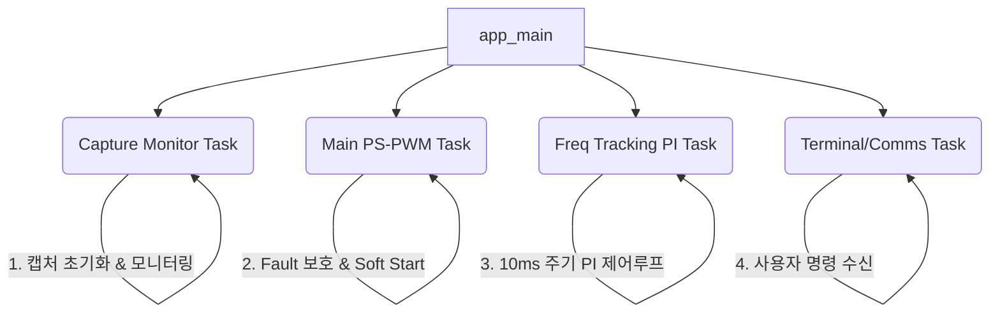

# ZVS Resonant Tracking API 사용 가이드

`examples/zvs_resonant_tracking` 예제를 참조하여, 공진 주파수 자동 트래킹(PI Control + PLL Lock) 기능을 포함한 PS-PWM 응용 프로그램을 개발할 때 필요한 핵심 로직과 구조를 설명합니다.

---

## 1. 공진 주파수 트래킹(ZVS) 원리

영전압 스위칭(ZVS, Zero Voltage Switching)이나 LLC 공진형 컨버터에서는 부하나 입력 전압 변동에 따라 공진 주파수가 변하게 됩니다. 이를 추종하여 항상 최적의 스위칭 상태를 유지하기 위해 다음과 같은 피드백 루프를 구성합니다.

1. **상태 측정**: 리딩 레그(Leading Leg)의 스위칭 시작점(Start)과 탱크 전류의 영점 교차점(Zero-Crossing, ZC) 사이의 지연 시간(Delay)을 측정합니다.
2. **오차 계산**: 측정된 딜레이 값과 사용자가 설정한 목표 딜레이(Target ZVS Delay)의 차이를 계산합니다.
3. **PI 제어 및 주파수 갱신**: 오차(Error)를 바탕으로 비례-적분(PI) 제어를 수행하여 새로운 스위칭 주파수를 도출하고 PWM 주파수를 갱신합니다.

---

## 2. 핵심 API 함수

주파수 트래킹을 위해서는 캡처(Capture) 타이머 모듈을 활성화하고 지연 시간을 읽어와야 합니다.

### 2.1. 캡처 모듈 초기화

| 함수 | 설명 |
|---|---|
| [pspwm_enable_tracking_capture()](file:///home/yoonki/esp/myWorks/esp32_ps_pwm/include/ps_pwm.h#L320) | Start 신호 핀과 ZC 신호 핀을 캡처 모듈에 연결하고 활성화합니다. |
| [pspwm_register_start_capture_callback()](file:///home/yoonki/esp/myWorks/esp32_ps_pwm/include/ps_pwm.h#L335) | (선택) Start 캡처 시점에 호출될 인터럽트 콜백을 등록합니다. |

```c
// 캡처 채널 활성화 (예: Start 핀 = GPIO 4, ZC 입력 핀 = GPIO 9)
esp_err_t err = pspwm_enable_tracking_capture(MCPWM_UNIT_0, GPIO_NUM_4, GPIO_NUM_9);
```

### 2.2. 지연 시간 측정

| 함수 | 반환 | 용도 |
|---|---|---|
| [pspwm_get_measured_delay_us()](file:///home/yoonki/esp/myWorks/esp32_ps_pwm/include/ps_pwm.h#L327) | `float` | Start와 ZC 사이의 지연 시간을 마이크로초(us) 단위로 반환 |

```c
// 최신 측정된 지연 시간 읽기
float delay_us = pspwm_get_measured_delay_us(MCPWM_UNIT_0);
if (delay_us >= 0.0f) {
    // 유효한 측정값이 존재함
}
```

---

## 3. 주파수 트래킹 PI 제어 로직

메인 제어 루프와 별도로, 일정한 주기(예: 1ms ~ 10ms)로 실행되는 **트래킹 전용 태스크(Task)**를 구성하는 것이 좋습니다.
> [!NOTE]
> 전력전자 분야에서 하드웨어 스위칭 제어(수 µs 주기)와 달리 MCU의 소프트웨어 기반 ZVS 트래킹과 같은 보조 감시 루프는 시스템 응답성과 RTOS 오버헤드를 고려하여 **1ms ~ 10ms (100Hz ~ 1kHz)** 주기로 실행하는 것이 일반적이며 타당합니다.

```c
// PI 제어 게인 및 제어 한계 설정값
float track_kp = 50.0f;               // 비례 게인
float track_ki = 5.0f;                // 적분 게인
float target_zvs_delay = 5.0f;        // 목표 ZVS 딜레이 (us)
float current_target_freq = 20000.0f; // 현재 설정 주파수

// 안전 및 튜닝 변수 (매직 넘버를 직관적 변수로 대체)
float pll_deadband_us = 0.1f;         // 락킹(Locking) 판정 오차 범위
float freq_max = 25000.0f;            // 최대 허용 주파수 (Clamping)
float freq_min = 15000.0f;            // 최소 허용 주파수 (Clamping)

void freq_tracking_task(void *arg) {
    float last_error = 0.0f;
    const float dt = 0.01f; // 제어 주기 (10ms = 0.01초)
    
    while(1) {
        // [상태 변수 설명]
        // is_pwm_on: 메인 제어 태스크나 사용자 버튼 입력 등에서 PWM 출력이 켜졌을 때 true로 설정됩니다.
        // auto_track_en: 사용자가 수동으로 켜거나, 기동(Soft Start) 완료 후 안정화 시점에 자동으로 true로 설정되도록 설계합니다.
        if (is_pwm_on && auto_track_en) {
            float current_delay = pspwm_get_measured_delay_us(MCPWM_UNIT_0);
            
            if (current_delay >= 0.0f) {
                // 1. 오차 계산
                float error = current_delay - target_zvs_delay;
                
                // 2. PLL Lock (Dead-band 처리)
                // 오차가 설정한 데드밴드 범위 이내라면 완전히 동기화된 것으로 간주 (주파수 고정)
                if (error > -pll_deadband_us && error < pll_deadband_us) {
                    error = 0.0f; 
                }
                
                // 3. 속도형(Incremental) PI 제어 연산
                // 현재 상태에서 오차의 '변화량'만큼 주파수를 미세 조정
                float delta_p = track_kp * (error - last_error);
                float delta_i = track_ki * error * dt;
                
                // 4. 주파수 갱신
                // 측정 딜레이가 목표치보다 크면 주파수를 감소시킴 (공진 주파수 위쪽 영역 동작 가정)
                float new_freq = current_target_freq - (delta_p + delta_i);
                last_error = error;
                
                // 5. 안전 범위 제한 (Clamping)
                if (new_freq > freq_max) new_freq = freq_max;
                if (new_freq < freq_min) new_freq = freq_min;
                
                current_target_freq = new_freq;
                
                // 6. 하드웨어 주파수 업데이트 (실제 반영)
                pspwm_set_frequency(MCPWM_UNIT_0, current_target_freq);
            }
        } else {
            last_error = 0.0f; // PWM이 꺼져있을 땐 적분항 누적(Wind-up) 방지를 위해 리셋
        }
        
        // 10ms마다 제어 루프 실행
        vTaskDelay(pdMS_TO_TICKS(10));
    }
}
```

> [!TIP]
> **PLL Lock (Dead-band)**: 목표치에 근접했을 때 제어값이 미세하게 진동(발진)하는 것을 막아주는 중요한 역할을 합니다. 노이즈 레벨을 고려하여 Dead-band 폭을 조정하세요.

---

## 4. 멀티 태스크 아키텍처 추천

ZVS 자동 트래킹 프로그램을 설계할 때, 시스템의 응답성과 안정성을 위해 다음과 같이 책임을 분리한 멀티 태스크 아키텍처를 권장합니다.



1. **Capture Monitor Task**: `pspwm_enable_tracking_capture()`를 호출하고, 측정된 딜레이 로그를 주기적으로 출력하여 모니터링합니다. 캡처 초기화가 완료되었음을 플래그로 설정하여 메인 태스크가 이를 기다리도록 동기화합니다.
2. **Main PS-PWM Task**: `pspwm_init_symmetrical()`로 기본 출력을 설정하고 최우선적으로 `pspwm_get_hw_fault_shutdown_occurred()`를 폴링하여 하드웨어 Fault 시 신속하게 대응합니다. 사용자의 On/Off 명령 시 `pspwm_set_duty_soft()`로 안전하게 기동/정지합니다.
3. **Freq Tracking PI Task**: 10ms 주기로 `pspwm_get_measured_delay_us()`를 읽고, 속도형 PI 제어로 도출된 주파수를 `pspwm_set_frequency()`를 통해 하드웨어에 업데이트합니다.
4. **Comms/Terminal Task**: 사용자의 명령(주파수 수동 설정, 트래킹 On/Off 설정, 게인 값 조절 등)을 비동기적으로 처리합니다.

---

## 5. 설계 시 주의사항 (안전 장치)

* **주파수 Clamping**: PI 제어 연산 결과인 `new_freq`를 무조건 적용하지 말고 컨버터의 물리적 한계를 벗어나지 않도록 **안전 범위(Min/Max limit)**를 두어야 합니다.
* **적분 누적(Wind-up) 방지**: PWM 출력이 꺼져 있거나, 트래킹 기능이 비활성화되었을 때는 `last_error`를 초기화하여 PI 수식이 엉뚱한 방향으로 발산하는 것을 막아야 합니다.
* **속도형 PI 제어**: 일반적인 PI 제어(절대값 갱신) 대신, 오차의 변화량(`error - last_error`)만 반영하는 **속도형(Incremental) PI 제어**를 사용하면 목표 주파수 변경 시나 트래킹 시작 시 갑작스러운 제어값 폭주를 방지할 수 있습니다.
