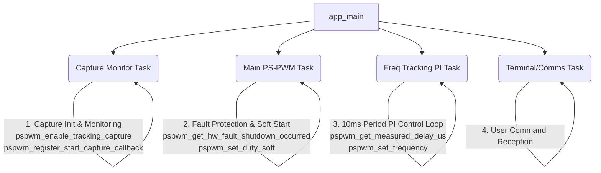

# ZVS Resonant Tracking API Usage Guide

Referring to the `examples/zvs_resonant_tracking` example, this guide explains the core logic and structure needed when developing a PS-PWM application that includes resonant frequency auto-tracking (PI Control + PLL Lock).

---

## 1. ZVS Resonant Frequency Tracking Principle

In Zero Voltage Switching (ZVS) or LLC resonant converters, the resonant frequency changes depending on load or input voltage variations. To track this and always maintain the optimal switching state, a feedback loop is configured as follows:

1. **State Measurement**: Measures the delay time between the switching start point (Start) of the Leading Leg and the zero-crossing point (ZC) of the tank current.
2. **Error Calculation**: Calculates the difference between the measured delay value and the user-defined Target ZVS Delay.
3. **PI Control and Frequency Update**: Performs Proportional-Integral (PI) control based on the error to derive a new switching frequency and updates the PWM frequency.

---

## 2. Core API Functions

For frequency tracking, you need to enable the Capture timer module and read the delay time.

### 2.1. Capture Module Initialization

| Function | Description |
|---|---|
| [pspwm_enable_tracking_capture()](file:///home/yoonki/esp/myWorks/esp32_ps_pwm/include/ps_pwm.h#L320) | Connects and enables the Start signal pin and ZC signal pin to the capture module. This must be called essentially for delay time measurement. |
| [pspwm_register_start_capture_callback()](file:///home/yoonki/esp/myWorks/esp32_ps_pwm/include/ps_pwm.h#L335) | (Optional) Registers an interrupt callback to be called at the Start capture moment. (See the 'Capture Monitor Task' explanation in Section 4 below for detailed usage) |

```c
// Enable capture channels (e.g., Start pin = GPIO 4, ZC input pin = GPIO 9)
esp_err_t err = pspwm_enable_tracking_capture(MCPWM_UNIT_0, GPIO_NUM_4, GPIO_NUM_9);

// (Optional) Start capture callback function prototype
// void pspwm_register_start_capture_callback(mcpwm_unit_t mcpwm_num, void (*cb)(uint32_t cap_val, void* arg), void* arg);
```

### 2.2. Delay Time Measurement

| Function | Returns | Purpose |
|---|---|---|
| [pspwm_get_measured_delay_us()](file:///home/yoonki/esp/myWorks/esp32_ps_pwm/include/ps_pwm.h#L327) | `float` | Returns the delay time between Start and ZC in microseconds (us) |

```c
// Read the most recently measured delay time
float delay_us = pspwm_get_measured_delay_us(MCPWM_UNIT_0);
if (delay_us >= 0.0f) {
    // A valid measurement exists
}
```

---

## 3. Frequency Tracking PI Control Logic

Separate from the main control loop, it is recommended to construct a **dedicated tracking task** executed at a constant period (e.g., 1ms ~ 10ms).
> [!NOTE]
> Unlike hardware switching control (which operates on periods of a few µs) in the power electronics field, it is common and appropriate to execute supplementary monitoring loops like software-based ZVS tracking on an MCU at a period of **1ms ~ 10ms (100Hz ~ 1kHz)**, considering system responsiveness and RTOS overhead.

```c
// PI control gains and control limit settings
float track_kp = 50.0f;               // Proportional gain
float track_ki = 5.0f;                // Integral gain
float target_zvs_delay = 5.0f;        // Target ZVS Delay (us)
float current_target_freq = 20000.0f; // Current target frequency

// Safety and tuning variables (replacing magic numbers with intuitive variables)
float pll_deadband_us = 0.1f;         // Locking determination error range
float freq_max = 25000.0f;            // Maximum allowable frequency (Clamping)
float freq_min = 15000.0f;            // Minimum allowable frequency (Clamping)

void freq_tracking_task(void *arg) {
    float last_error = 0.0f;
    const float dt = 0.01f; // Control period (10ms = 0.01 seconds)
    
    while(1) {
        // [State Variables Description]
        // is_pwm_on: Set to true when the PWM output is turned on, such as in the main control task or by user button input.
        // auto_track_en: Designed to be set to true either manually by the user, or automatically once stabilization is reached after startup (Soft Start) is complete.
        if (is_pwm_on && auto_track_en) {
            float current_delay = pspwm_get_measured_delay_us(MCPWM_UNIT_0);
            
            if (current_delay >= 0.0f) {
                // 1. Calculate Error
                float error = current_delay - target_zvs_delay;
                
                // 2. PLL Lock (Dead-band processing)
                // If the error is within the set dead-band range, consider it completely synchronized (Frequency fixed)
                if (error > -pll_deadband_us && error < pll_deadband_us) {
                    error = 0.0f; 
                }
                
                // 3. Incremental PI Control calculation
                // Fine-tune the frequency by the 'amount of change' in error from the current state
                float delta_p = track_kp * (error - last_error);
                float delta_i = track_ki * error * dt;
                
                // 4. Update Frequency
                // If the measured delay is larger than the target, decrease the frequency (assuming operation in the region above resonant frequency)
                float new_freq = current_target_freq - (delta_p + delta_i);
                last_error = error;
                
                // 5. Safe Range Limitation (Clamping)
                if (new_freq > freq_max) new_freq = freq_max;
                if (new_freq < freq_min) new_freq = freq_min;
                
                current_target_freq = new_freq;
                
                // 6. Hardware Frequency Update (Actual application)
                pspwm_set_frequency(MCPWM_UNIT_0, current_target_freq);
            }
        } else {
            last_error = 0.0f; // Reset to prevent integral term accumulation (Wind-up) when PWM is off
        }
        
        // Execute control loop every 10ms
        vTaskDelay(pdMS_TO_TICKS(10));
    }
}
```

> [!TIP]
> **PLL Lock (Dead-band)**: Plays an important role in preventing the control value from slightly oscillating (hunting) when it approaches the target value. Adjust the Dead-band width considering the noise level.

---

## 4. Recommended Multi-Task Architecture

When designing a ZVS auto-tracking program, it is recommended to use a multi-task architecture that separates responsibilities for system responsiveness and stability, as follows:



1. **Capture Monitor Task**: 
   - Initializes the capture hardware for ZC measurement by calling `pspwm_enable_tracking_capture()`, and periodically outputs the measured delay logs for monitoring.
   - For HIL (Hardware-in-the-Loop) testing to generate simulation ZC pulses, or to precisely match synchronization timing with specific hardware, `pspwm_register_start_capture_callback()` can be used to operate an interrupt callback at the moment of the Leading Leg (Start) capture.
   - Sets a flag indicating that capture initialization is complete to synchronize the main task to wait for it.
2. **Main PS-PWM Task**: Sets up basic output with `pspwm_init_symmetrical()` and prioritizes polling `pspwm_get_hw_fault_shutdown_occurred()` to respond quickly in case of a hardware fault. Upon user On/Off commands, it safely starts/stops using `pspwm_set_duty_soft()`.
3. **Freq Tracking PI Task**: Reads `pspwm_get_measured_delay_us()` every 10ms and updates the hardware through `pspwm_set_frequency()` with the frequency derived by incremental PI control.
4. **Comms/Terminal Task**: Asynchronously processes user commands (manual frequency setting, tracking On/Off setting, gain adjustment, etc.).

---

## 5. Design Precautions (Safety Mechanisms)

* **Frequency Clamping**: Do not apply the `new_freq` resulting from the PI control calculation unconditionally. A **safe range (Min/Max limit)** must be set so as not to exceed the physical limits of the converter.
* **Anti-Windup**: When the PWM output is turned off or the tracking function is disabled, `last_error` should be initialized to prevent the PI formula from diverging in an unexpected direction due to error accumulation.
* **Incremental PI Control**: Instead of general PI control (absolute value update), using **Incremental PI Control** which only reflects the change in error (`error - last_error`) can prevent sudden spikes in the control value when changing the target frequency or starting tracking.
